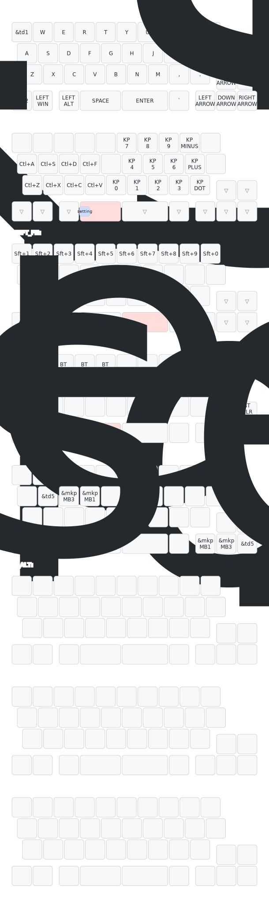

このリポジトリは設計者向けに公開しています。

+ 総合案内は[こちら](https://github.com/nazuna293/Enigma_03)です。
+ ユーザー向けのファームウェア(リポジトリ)は[こちら](https://github.com/nazuna293/zmk-Enigma_03-user-config)です。

## 初期キーマップ
### Tap Dance
|name|tap|hold|2tap|tap hold|
|:-:|:-:|:-:|:-:|:-:|
|tp1|Tab|Ctrl|Q||

※レイヤーに推移している間はALTキーが押されている状態になっています。

